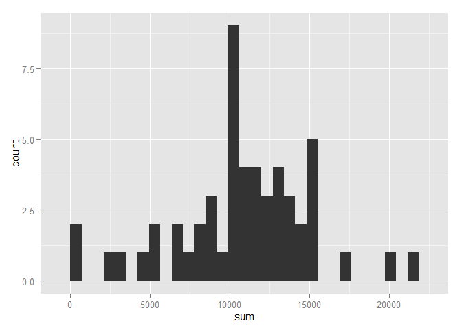
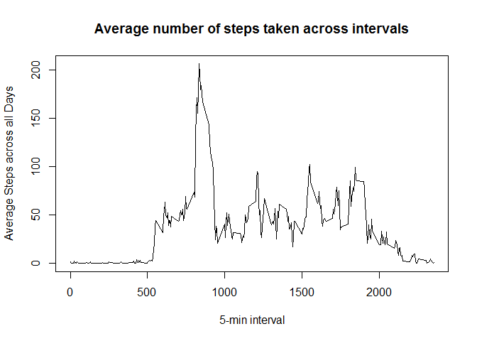
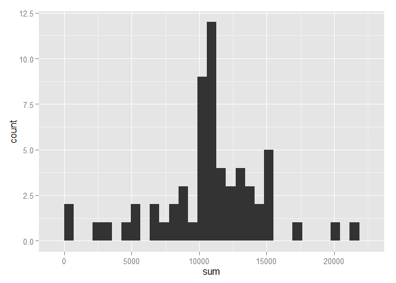
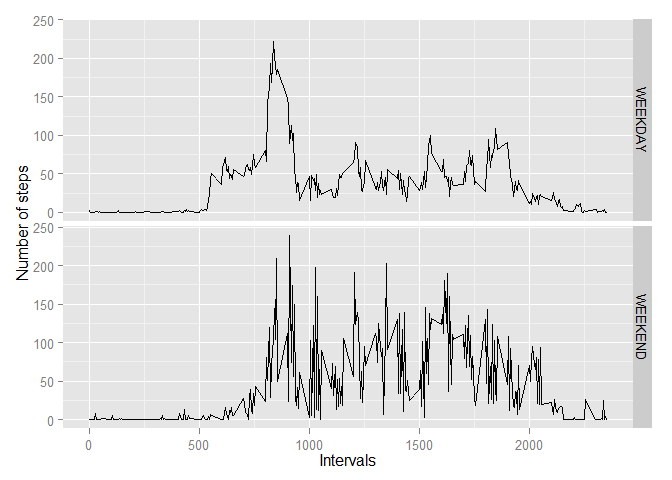

# Reproducible Research: Peer Assessment 1
## Loading Required Libraries

```r
library(data.table)
```

```
## Warning: package 'data.table' was built under R version 3.1.2
```

```r
library(ggplot2)
```

```
## Warning: package 'ggplot2' was built under R version 3.1.2
```

```r
library(plyr)
```

```
## Warning: package 'plyr' was built under R version 3.1.2
```
  
## Loading and preprocessing the data

```r
activity <- data.table(read.csv(".//activity.csv"))
activity$date <- as.Date(activity$date, "%Y-%m-%d")
activity <- mutate(activity, day_type = ifelse(weekdays(date)==c("Saturday", "Sunday"), "WEEKEND", "WEEKDAY") )
```
  
## What is mean total number of steps taken per day?
### Calculating the total number of steps each day

```r
daily_total <- activity[,list(sum=sum(steps)),by=date]
```
  
### 1. Make a histogram of the total number of steps taken each day

```r
qplot(sum, data=daily_total, geom="histogram")
```

```
## stat_bin: binwidth defaulted to range/30. Use 'binwidth = x' to adjust this.
```

 
  
### 2. Calculate and report the mean and median total number of steps taken per day

```r
mean(daily_total$sum, na.rm=TRUE)
```

```
## [1] 10766.19
```

```r
median(daily_total$sum, na.rm=TRUE)
```

```
## [1] 10765
```
  
## What is the average daily activity pattern?
### 1. Make a time series plot (i.e. type = "l") of the 5-minute interval (x-axis) and the average number of steps taken, averaged across all days (y-axis)

```r
time_series <- tapply(activity$steps, activity$interval, mean, na.rm = TRUE)
plot(row.names(time_series), time_series, type = "l", xlab = "5-min interval", 
    ylab = "Average Steps across all Days", main = "Average number of steps taken across intervals")
```

 
  
### 2. Which 5-minute interval, on average across all the days in the dataset, contains the maximum number of steps?

```r
max_steps <- which.max(time_series)
names(max_steps)
```

```
## [1] "835"
```
  
## Imputing missing values
### 1. Calculate and report the total number of missing values in the dataset (i.e. the total number of rows with NAs)

```r
sum(!complete.cases(activity))
```

```
## [1] 2304
```
  
### 2. Devise a strategy for filling in all of the missing values in the dataset. The strategy does not need to be sophisticated. For example, you could use the mean/median for that day, or the mean for that 5-minute interval, etc.
### 3. Create a new dataset that is equal to the original dataset but with the missing data filled in.

```r
activity_filled <- activity
activity_filled$steps[is.na(activity$steps)] <- time_series
```
  
### 4. Make a histogram of the total number of steps taken each day and Calculate and report the mean and median total number of steps taken per day. Do these values differ from the estimates from the first part of the assignment? What is the impact of imputing missing data on the estimates of the total daily number of steps?

```r
daily_total_filled <- activity_filled[,list(sum=sum(steps)),by=date]
qplot(sum, data=daily_total_filled, geom="histogram")
```

```
## stat_bin: binwidth defaulted to range/30. Use 'binwidth = x' to adjust this.
```

 

```r
mean(daily_total_filled$sum, na.rm=TRUE)
```

```
## [1] 10766.19
```

```r
median(daily_total_filled$sum, na.rm=TRUE)
```

```
## [1] 10766.19
```
Same Mean but median has changed. Median has shifted as NAs are replaced by values, increasing the count. 

## Are there differences in activity patterns between weekdays and weekends?

```r
activity_day_type <- ddply(activity, .(day_type, interval), summarise,
                    steps = mean(steps, na.rm=TRUE))
qplot(interval, steps, data = activity_day_type, geom = "line", facets = day_type ~ .,
      xlab = "Intervals", ylab = "Number of steps") 
```

 
  
Spikes are generally higher during weekends than weekdays, i.e. they don't taper off after the highest spike. Periods of low activities in both time frames show similar trend (close to 0 in the early morning)
